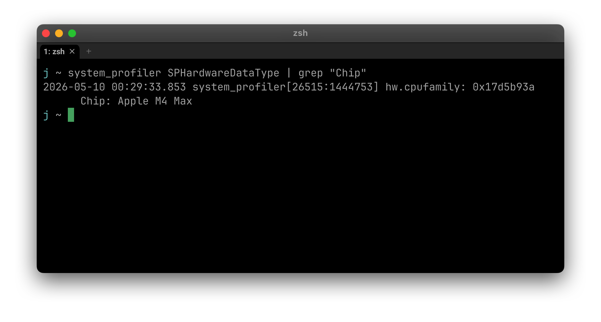
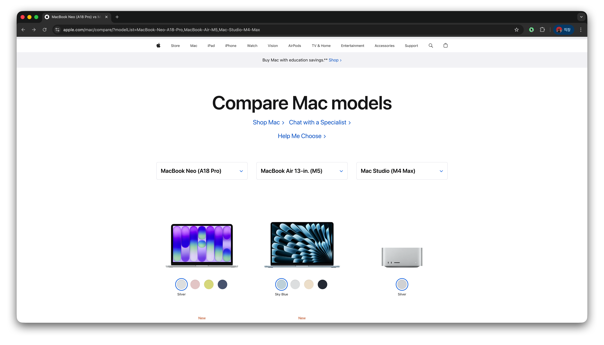
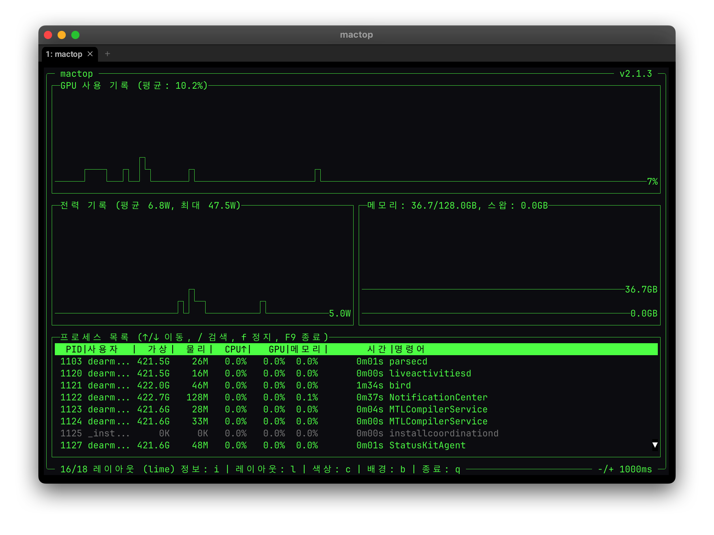
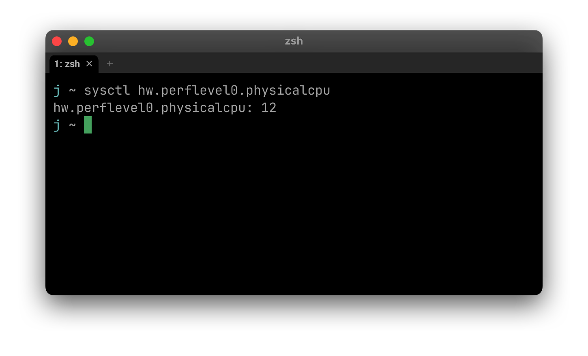

# 모델 속도를 결정짓는 것들 (5편)

> 로컬 LLM이 빠를지 느릴지는 칩 세대보다 메모리 스펙·소프트웨어 설정이 결정해요. 이 편에서는 **속도를 결정짓는 요인들을 하나씩** 자세히 봅니다.

## 사전 준비
- 1편(사전 준비), 2편(llama.cpp 설치), 3편(엔진 비교), 4편(모델 이름) 완료

---

## 하드웨어 — 메모리가 핵심

### 1. 메모리 대역폭 (1순위 결정 요인)
### 이게 뭐예요?
**1초에 얼마나 많은 데이터를 메모리에서 읽을 수 있는지**를 나타내는 숫자예요. 단위는 GB/s(초당 기가바이트). LLM 속도를 좌우하는 **가장 중요한 하드웨어 스펙**입니다.

> 💡 비유: 메모리 대역폭은 **"고속도로의 차선 수 × 제한 속도"** 예요. 차선이 많고 속도가 빠를수록 데이터가 한꺼번에 더 많이 흐를 수 있어요.

### 왜 LLM에선 컴퓨팅보다 메모리 대역폭이 중요해요?

LLM은 답을 한 글자(토큰) 만들 때마다 **모델 전체 가중치를 메모리에서 한 번 다 읽어야** 해요. 그래서 속도가 거의 메모리 읽기 속도에 비례합니다.

**계산 공식:**

```
이론적 최대 속도 (tok/s) ≈ 메모리 대역폭 (GB/s) ÷ 모델 크기 (GB)
```

27B Q4 모델(약 18GB) 기준 예시:
- M4 Max (546 GB/s): 546 ÷ 18 ≈ **30 tok/s**
- M4 Pro (273 GB/s): 273 ÷ 18 ≈ **15 tok/s**
- M4 base (120 GB/s): 120 ÷ 18 ≈ **6 tok/s**

같은 모델인데 칩 등급에 따라 **5배까지 차이가 나요.** 컴퓨팅 성능(FLOPS, GPU 코어 수)이 아니라 **메모리 대역폭이 진짜 결정 요인**입니다.

### Apple Silicon 칩별 메모리 대역폭 (2026 기준)

| 칩 | 메모리 대역폭 |
|---|---|
| M3 Ultra | 819 GB/s |
| M2 Ultra | 800 GB/s |
| **M4 Max** | **546 GB/s** |
| M3 Max | 400 GB/s |
| M2 Max | 400 GB/s |
| M4 Pro | 273 GB/s |
| M2 Pro | 200 GB/s |
| M3 Pro | 150 GB/s |
| M4 (base) | 120 GB/s |

같은 M4 패밀리여도 등급이 다르면 거의 5배 차이가 나요. **칩 세대보다 등급(Max/Ultra)이 더 중요**합니다.

### 어떻게 확인하나요?

#### 1. 내 칩 모델 확인 (CLI)

WezTerm에서 다음 명령어를 입력하면 됩니다:

```sh
system_profiler SPHardwareDataType | grep "Chip"
```

이렇게 칩 정보가 출력돼요 (예: M4 Max):


칩 모델을 확인한 뒤, [Apple 공식 사양 페이지](https://www.apple.com/mac/compare/)나 위 표에서 대역폭을 찾으면 됩니다:


#### 2. 실제 사용 대역폭 — 토큰 속도로 역산

> ⚠️ **솔직히 말하면**, 2026년 기준 **M4 Max에서 실시간 메모리 대역폭(GB/s)을 직접 보여주는 도구는 없어요.** Apple이 macOS의 `powermetrics`에서 DCS 데이터를 막아둬서 fluidtop·asitop·macmon·pumas 다 못 보여줘요. mactop의 DRAM bandwidth 기능도 M5+ 칩에서만 작동해요.

대신 **토큰 속도로 역산**하면 돼요. llama-server나 llama-cli가 실시간으로 출력하는 tok/s 숫자를 곱하면 실제 사용 대역폭이 나옵니다.

```
실제 사용 대역폭 (GB/s) = tok/s × 모델 크기 (GB)
활용률 (%) = 실제 / 이론(스펙)
```

**예시 (Qwen 27B Q4 ≈ 18GB, M4 Max 546 GB/s):**
- llama-server가 28 tok/s 출력
- 28 × 18 = **504 GB/s 사용 중**
- 504 / 546 = **92% 활용** → 풀 파워 ✅

이게 가장 정확한 측정 방법이에요.

#### 3. 시스템 모니터링 — `mactop`

직접 대역폭은 못 봐도 **GPU 사용률·전력·메모리·스왑**을 시계열 그래프로 보여주는 도구가 있어요. LLM 돌릴 때 풀 파워로 도는지 확인하는 데 충분합니다.

**[`mactop`](https://github.com/metaspartan/mactop)** — Go로 짠 Apple Silicon 모니터, sudo 필요 없음.

```sh
brew install mactop
mactop
```

`l` 키로 레이아웃 전환 (시계열 그래프 레이아웃이 LLM 모니터링에 좋음).



#### LLM 풀 파워 체크리스트

mactop 띄워두고 llama-server에 프롬프트 보내면서 다음 4가지 확인해요:

| 지표 | 정상 (생성 중) | 비정상 신호 |
|---|---|---|
| **GPU 사용률** | 80~100% | 50% 이하 → CPU에서 도는 중 (`-ngl 99` 빠짐) |
| **전력** | 30~80W | 5W 유지 → 추론이 GPU에 안 올라감 |
| **메모리 + 스왑** | 모델 크기만큼 사용, 스왑 0 | 스왑 1GB+ → 메모리 부족 |
| **토큰 속도** | 이론치의 80%+ | 50% 이하 → 설정 문제 또는 throttle |

### 정리
- 메모리 대역폭 = **LLM 속도의 1순위 결정 요인**
- 같은 칩 패밀리여도 등급(Pro/Max/Ultra)이 5배 차이
- 칩 사양 확인: `system_profiler` 명령어 + Apple 사양표
- 실제 사용 대역폭: **토큰 속도 × 모델 크기**로 역산
- 시스템 모니터링: `mactop`으로 GPU%·전력·메모리 시계열 그래프 보기

---

### 2. 메모리 용량과 헤드룸
### 이게 뭐예요?
**모델이 내 맥북에 들어갈 수 있느냐의 문제예요.** 메모리-대역폭이 "얼마나 빠른가"를 결정한다면, 메모리 용량은 "돌릴 수 있는가 없는가"를 결정합니다.

### 무엇이 메모리에 들어가나요?

LLM을 돌릴 때 통합 메모리에 동시에 올라가야 하는 것들:

```
모델 가중치 + KV 캐시 + macOS + 다른 앱
```

- **모델 가중치**: 파라미터 수 × 양자화 비트 ÷ 8 (예: 27B Q4 = 약 18GB)
- **KV 캐시**: 이전 입력을 저장해두는 공간. 컨텍스트가 길수록 커짐 (긴 글 분석할 땐 GB 단위로 추가)
- **macOS와 다른 앱**: macOS만 5~8GB는 먹어요. 브라우저·Slack 등 켜져 있으면 더 늘어남

### 헤드룸 — 60% 룰

**모델이 통합 메모리의 60% 이하를 차지하게 잡으세요.** 나머지 40%는 KV 캐시·다른 앱·OS 몫이에요.

| 통합 메모리 | 안전한 모델 한계 (Q4 기준) |
|---|---|
| 16GB | 7B 모델 (~5GB) |
| 32GB | 14B 모델 (~9GB) |
| 64GB | 30~35B 모델 (~22GB) |
| 96GB | 50B 모델 |
| 128GB | 70B 모델 (~45GB), 27B Q8도 OK |
| 192GB+ | 100B+ MoE 모델 |

이 한계를 넘기면 멀티턴 대화·긴 컨텍스트에서 메모리 부족(OOM)이 나거나, SSD로 스왑이 일어나서 속도가 10분의 1로 떨어져요.

### 메모리 용량과 속도의 관계

용량이 부족할수록 단계적으로 문제가 발생해요:

1. **충분한 경우**: 모든 게 RAM에 올라가서 빠름
2. **빠듯한 경우**: KV 캐시가 짧아지고 컨텍스트 길이 줄여야 함
3. **부족한 경우**: SSD로 스왑 → 속도 10배 감소
4. **완전 부족**: OOM 에러로 추론 자체가 안 됨

### 정리
- 모델 크기는 **Q4 기준 파라미터 × 0.5바이트**로 계산
- 통합 메모리의 **60% 이하**로 모델 잡기 (헤드룸)
- 부족하면 더 낮은 양자화(Q3) 또는 더 작은 모델로 가기

---

## 모델 자체 — 같은 하드웨어에서도 모델에 따라 다름

### 3. 양자화와 속도
### 이게 뭐예요?
**양자화 레벨은 모델 크기를 결정하고, 모델 크기는 속도를 결정해요.** 같은 모델이어도 Q4와 Q8은 거의 두 배 속도 차이가 납니다.

> 💡 양자화 표기법은 모델 이름 응용편에서 확인할 수 있어요.

### 왜 양자화가 속도에 영향을 줘요?

LLM 속도는 메모리 대역폭에 비례하는데, 모델 크기가 작아지면 한 번에 읽어야 할 데이터가 줄어 → 같은 대역폭에서 더 많은 토큰을 만들 수 있어요.

**계산 (M4 Max 546 GB/s 기준):**
- 27B Q4 (~18GB): 546 ÷ 18 ≈ **30 tok/s**
- 27B Q8 (~28GB): 546 ÷ 28 ≈ **19 tok/s**
- 27B bf16 (~54GB): 546 ÷ 54 ≈ **10 tok/s**

양자화 레벨을 올리면 메모리 사용량이 늘고 → 속도가 떨어집니다.

### 양자화 레벨 vs 속도 vs 품질

| 양자화 | 27B 크기 | M4 Max 속도 | 품질 |
|---|---|---|---|
| `Q4_K_M` | ~18GB | ~30 tok/s | 양호 (표준) |
| `Q5_K_M` | ~19GB | ~28 tok/s | 좋음 |
| `Q6_K` | ~22GB | ~24 tok/s | 우수 |
| `Q8_0` | ~28GB | ~19 tok/s | 거의 원본 |
| `bf16` | ~54GB | ~10 tok/s | 원본 |

### 어떤 걸 골라야 하나요?

대부분의 경우 **`Q4_K_M`이 가장 균형 잡힌 선택**이에요.

- **속도가 중요하면**: Q4_K_M
- **품질이 중요하면**: Q6_K 또는 Q8_0
- **모델이 작으면(7B 이하)**: Q5_K_M이나 Q8_0이 효율적 (메모리 여유 있어서)
- **메모리가 빠듯하면**: Q3_K_M (품질 살짝 떨어짐)

### 정리
- 양자화 ↓ → 모델 크기 ↓ → 속도 ↑
- 양자화 ↓ → 품질 ↓ (살짝)
- 표준은 **`Q4_K_M`**
- 메모리 여유 있으면 Q5/Q6로 품질 올려도 OK

---

### 4. Dense vs MoE 속도 차이
### 이게 뭐예요?
**MoE 모델은 같은 메모리를 쓰면서도 훨씬 빨라요.** "큰 모델의 똑똑함"과 "작은 모델의 속도"를 둘 다 가져가려는 구조입니다.

> 💡 MoE/Dense 표기법은 모델 이름 응용편에서 확인할 수 있어요.

### 왜 MoE가 빠른가요?

LLM 속도는 **한 번에 메모리에서 읽는 가중치 양**에 비례하는데, MoE는 한 토큰을 만들 때 일부 전문가만 활성화해서 읽기 때문이에요.

예: Qwen 3.6 35B A3B
- 전체 메모리: 35B × 0.5바이트 = ~22GB (Q4)
- 한 번에 읽는 양: 3B × 0.5바이트 = ~2GB (Q4)
- 그래서 속도는 ≈ 3B 모델 수준

같은 22GB 메모리를 쓰는데 Dense 35B 모델보다 약 10배 빠릅니다.

### Dense 35B vs MoE 35B-A3B 비교 (Q4, M4 Max 기준)

| 모델 종류 | 메모리 | 한 번에 읽는 양 | 예상 속도 |
|---|---|---|---|
| Dense 35B Q4 | ~22GB | ~22GB | ~25 tok/s |
| MoE 35B-A3B Q4 | ~22GB | ~2GB | ~80+ tok/s |

같은 메모리를 차지하지만 속도는 압도적으로 MoE가 빨라요.

### 약점은 없나요?

- **품질은 같은 메모리의 Dense 모델보다 약간 떨어질 수 있음** — 한 번에 일부만 활성화돼서 같은 메모리 사이즈의 dense 모델보다는 정밀도가 살짝 낮아요
- **모델 종류가 적음** — Dense에 비해 MoE 모델 수가 적어요 (요즘 점점 많아지긴 함)

### 정리
- MoE는 **메모리는 큰 모델, 속도는 작은 모델** 효과
- Apple Silicon의 큰 통합 메모리와 잘 맞아요
- 추천: Qwen 3.6 35B A3B, DeepSeek MoE 같은 모델 시도해볼 가치 있음

---

### 5. 컨텍스트 길이와 Prefill
### 이게 뭐예요?
**입력이 길어지면 첫 응답이 늦어져요.** 모델은 답을 시작하기 전에 입력 전체를 한 번 쭉 읽어야 하는데, 이 단계를 **prefill(프리필)** 이라고 불러요.

### 두 단계로 나뉘는 추론 시간

LLM이 답을 내는 시간은 두 단계로 구성돼요:

1. **Prefill** — 내가 보낸 입력(질문이나 코드)을 모델이 한 번 쭉 읽는 시간. 입력 길이에 비례해서 길어짐.
2. **Generation** — 답을 한 글자씩 써 내려가는 시간. 출력 길이에 비례.

체감 속도 = Prefill 시간 + Generation 시간

### 왜 prefill이 길어요?

입력 토큰 하나하나에 대해 어텐션 계산을 해야 하기 때문이에요. 8K 토큰 입력이면 8K번 처리, 16K면 16K번. 거의 선형 스케일이에요.

### 컨텍스트 길이별 체감 속도 (예시)

| 입력 길이 | Prefill 시간 | Generation 시간 (200 tokens) | 총 시간 | 체감 |
|---|---|---|---|---|
| 500 토큰 | 0.5초 | 7초 | 7.5초 | 빠름 |
| 2K 토큰 | 2초 | 7초 | 9초 | 양호 |
| 8K 토큰 | 8초 | 7초 | 15초 | 느림 |
| 32K 토큰 | 32초 | 7초 | 39초 | 매우 느림 |

긴 입력 + 짧은 응답이 prefill 비중이 가장 커요. 반대로 짧은 입력 + 긴 응답은 prefill 영향 거의 없어요.

### KV 캐시로 prefill 줄이기

같은 프롬프트를 여러 번 쓰면 첫 번째만 prefill 비용이 들고, 두 번째부터는 캐시에서 바로 가져와요. 이걸 **KV 캐시 (또는 prompt caching)** 라고 합니다.

llama.cpp는 prompt caching이 안정적이라 멀티턴 대화에서 두 번째 턴부터 prefill 비용이 거의 없어져요.

### 컨텍스트 길이 설정 (`-c` 플래그)

llama-cli/llama-server에서 `-c` 플래그로 컨텍스트 크기를 정해요:

```sh
llama-server -m model.gguf -c 8192    # 8K 컨텍스트
llama-server -m model.gguf -c 32768   # 32K 컨텍스트
```

큰 컨텍스트는 KV 캐시 메모리도 더 먹으니까, 평소 작업 사이즈에 맞춰 잡으면 됩니다.

### 정리
- 입력이 길수록 prefill로 첫 응답이 늦어짐
- 8K 토큰 이상에선 prefill이 시간 대부분 차지
- 멀티턴 대화는 KV 캐시 덕에 두 번째 턴부터 빠름
- `-c` 플래그로 컨텍스트 크기 조절

---

## 소프트웨어 — 마지막 최적화

### 6. 추론 엔진과 플래그 튜닝
### 이게 뭐예요?
**같은 모델, 같은 하드웨어여도 추론 엔진과 플래그 설정에 따라 속도가 1.5~2배 차이 날 수 있어요.** 어떤 엔진을 쓰고 어떤 플래그를 줄지가 마지막 최적화 포인트입니다.

### 추론 엔진 선택

| 엔진 | 특징 |
|---|---|
| **llama.cpp** | 가장 성숙. 긴 컨텍스트·멀티턴에 강함. **이 시리즈의 메인** |
| MLX | 짧은 입력 + 긴 출력에서 빠름. Fine-tuning에 강점 |
| Ollama | llama.cpp 래퍼. 편하지만 속도 손해 |
| LM Studio | GUI 래퍼. 같은 모델인데 더 느림 |
| vLLM | 멀티 GPU 서빙용. Apple Silicon은 미지원 |

상세 비교는 [3편](/guide/3-llamacpp-vs-mlx/)에서 확인할 수 있어요.

### 자주 쓰는 플래그 (llama.cpp)

#### `-m` — 모델 파일
```sh
llama-server -m ~/models/qwen3.6-27b-Q4_K_M.gguf
```

#### `-c` — 컨텍스트 크기
```sh
-c 8192    # 8K (가벼움)
-c 32768   # 32K (긴 문서)
-c 131072  # 128K (책 한 권)
```

작을수록 KV 캐시 덜 먹고 빠릅니다.

#### `-ngl` — GPU에 올릴 레이어 수
```sh
-ngl 99    # 모든 레이어를 GPU에 (Apple Silicon은 보통 이걸로)
```

Apple Silicon 통합 메모리에선 `99`로 두면 알아서 다 GPU(Metal)로 처리됩니다.

#### `-t` — CPU 스레드 수
```sh
-t 12      # CPU 스레드 12개 (성능 코어 수에 맞춤)
```

**P-core(성능 코어) 수에만 맞추는 게 빨라요.** Apple Silicon에는 P-core(빠름)와 E-core(느림)가 섞여 있는데, llama.cpp는 모든 스레드를 동기화하면서 도니까 E-core가 끼면 P-core가 기다리느라 오히려 느려져요. 그래서 16코어(M4 Max) 통째로 쓰지 말고 P-core 12개에만 맞춥니다.

##### 내 칩의 P-core 수 확인
```sh
sysctl hw.perflevel0.physicalcpu
```

이렇게 P-core 수가 출력돼요 (M4 Max는 12):


이 숫자를 그대로 `-t` 값으로 쓰면 됩니다.

> 💡 `-ngl 99`로 모든 레이어를 GPU에 올리면 CPU는 거의 안 쓰여서 `-t` 값이 별로 영향 없어요. CPU 추론할 때만 정확히 P-core 수에 맞추면 됩니다.

#### `-fa` — Flash Attention
```sh
-fa
```

긴 컨텍스트에서 prefill을 빠르게 해주는 어텐션 기법. 켜두면 거의 손해 없어요.

#### `--port` — 서버 포트
```sh
--port 8080    # 기본
--port 8081    # 다른 모델과 동시에 띄울 때 충돌 방지
```

OpenAI 호환 API가 이 포트로 열려요. curl·Cline·Continue 등에서 `http://localhost:8080`으로 접속.

#### `-np` — 병렬 시퀀스 개수
```sh
-np 1    # 한 번에 한 요청만 처리
-np 4    # 동시에 4개 요청 처리 가능 (멀티 사용자 서빙)
```

혼자 쓰면 `1`로 두면 됩니다. 메모리도 절약돼요. **MTP 쓸 땐 `-np 1` 필수** (멀티 시퀀스 미지원).

#### `--temp` — 샘플링 온도
```sh
--temp 0       # 결정적 (같은 입력 → 같은 출력)
--temp 0.7     # 표준 (창의성 + 일관성 균형)
--temp 1.0+    # 더 창의적·랜덤
```

코딩·정확한 답이 필요하면 0~0.3, 일반 대화·창작이면 0.7 정도가 무난해요. Qwen 시리즈 권장은 `0.7`.

#### `--top-k` — 상위 K개 토큰만 고려
```sh
--top-k 20     # 매 단계 상위 20개 후보 중 샘플링
--top-k 40     # 더 다양함
--top-k 0      # 비활성 (전체 후보)
```

낮을수록 안정적, 높을수록 다양함. Qwen 권장은 `20`.

> 💡 `--temp`와 `--top-k`는 응답 **품질·다양성**에 영향, **속도엔 영향 없음.**

### 추천 시작 플래그 (M4 Max + Qwen 3.6 27B)

```sh
llama-server \
  -m ~/models/qwen3.6-27b-Q4_K_M.gguf \
  -c 32768 \
  -ngl 99 \
  -t 12 \
  -fa \
  --port 8080
```

이걸 베이스로 시작해서 본인 워크로드에 맞춰 `-c`만 조절하면 됩니다.

### 정리
- 엔진은 **llama.cpp**가 표준
- `-ngl 99`로 GPU 다 쓰기
- `-c`는 워크로드에 맞춰 (긴 문서 작업이면 32K+)
- `-t`는 성능 코어 수에 맞춤
- `-fa`는 켜두기

---

### 7. 추론 가속 기술 (MTP, Speculative Decoding 등)
### 이게 뭐예요?
**같은 모델을 더 빠르게 돌리기 위한 알고리즘 기법들이에요.** 모델이나 하드웨어를 안 바꿔도 속도를 끌어올릴 수 있는 마지막 카드입니다.

### 1. MTP (Multi-Token Prediction)

**한 번에 여러 토큰을 예측하는 기법.** 보통은 한 토큰씩 예측하는데, MTP를 쓰면 한 번 추론할 때 여러 토큰을 한꺼번에 예측해요.

- **속도 향상**: 약 **2.5x**
- **지원 모델**: Qwen 3.6 27B, Gemma 4 같은 최신 모델
- **사용 조건**: 모델이 MTP 학습돼 있어야 함. 이름에 `MTP` 붙은 모델 받기

```sh
llama-server -m model.gguf --spec-type mtp --spec-draft-n-max 3
```

**👍 장점**
- 품질 손실 없음 (메인 모델이 검증함)
- 코드·구조화된 출력에선 최대 3x 가속
- 별도 작은 모델 안 받아도 됨 (모델 안에 헤드 내장)

**👎 단점**
- 모델 자체가 MTP 학습돼야만 가능 (일반 모델엔 못 씀)
- `--spec-draft-n-max`는 모델·양자화별로 다름. Qwen 3.6 27B에선 **3이 sweet spot** (저자 실측)
- 비전(이미지) + MTP 조합 불안정 (2026-05 기준)
- 추론 모델(R1 등)에선 효과 작음 (단거리 의존성만 잘 잡음)
- llama.cpp 구현 미성숙 (PR 빌드 필요한 경우 있음)

### 2. Speculative Decoding

**작은 "초안" 모델이 미리 답을 예측하고, 큰 모델이 검증하는 기법.** 대부분의 토큰은 작은 모델이 예측한 게 맞기 때문에, 평균적으로 추론 속도가 1.5~3배 빨라져요.

- **필요한 것**: 같은 패밀리의 큰 모델 + 작은 모델 (예: Qwen 27B + Qwen 0.6B)

```sh
llama-server -m big-model.gguf --model-draft small-model.gguf
```

**👍 장점**
- 품질 손실 없음 (큰 모델이 검증함)
- MTP 학습 안 된 일반 모델에도 적용 가능
- 같은 패밀리 모델만 있으면 어디든 적용

**👎 단점**
- 작은 모델 추가로 메모리 더 먹음
- 모델 패밀리 안에 작은 사이즈가 있어야 함 (없으면 못 씀)
- 두 모델을 GPU에 같이 올려야 해서 셋업 복잡
- 작은 모델이 큰 모델과 너무 다르면 검증 실패율 높아져서 오히려 느려짐

### 3. Flash Attention

**어텐션 계산을 효율적으로 해서 prefill을 빠르게 하는 기법.** llama.cpp에선 `-fa` 플래그로 켭니다.

```sh
-fa
```

**👍 장점**
- 플래그 하나면 끝, 가장 간단
- 품질 손실 없음 (수학적으로 동일한 계산)
- prefill 1.5~2x 빨라짐 (긴 입력일수록 효과 큼)
- 메모리도 약간 절약

**👎 단점**
- generation 자체엔 거의 영향 없음 (prefill만 가속)
- 일부 오래된 양자화 형식과 호환 안 될 수 있음
- 짧은 입력엔 효과 미미

### 4. KV Cache Quantization

**KV 캐시 자체도 양자화해서 메모리를 줄이는 기법.** 컨텍스트가 길 때 KV 캐시가 GB 단위로 부담스러운데, 이걸 8비트로 양자화하면 메모리가 절반으로 줄어요.

```sh
llama-server -m model.gguf --cache-type-k q8_0 --cache-type-v q8_0
```

**👍 장점**
- KV 캐시 메모리 50% 절감 (q8_0) 또는 75% 절감 (q4_0)
- 더 긴 컨텍스트 가능, 또는 그만큼 다른 거 메모리 여유
- Flash Attention과 함께 쓰면 효과 더 큼

**👎 단점**
- 속도는 안 빨라짐 (오히려 미세하게 느려질 수 있음)
- 양자화 레벨 낮추면(q4) 긴 컨텍스트에서 품질 살짝 떨어짐
- 일부 모델·플랫폼에서 호환 안 될 수 있음 (Flash Attention 필수인 경우 많음)

### 비교 표

| 기법 | 속도 향상 | 메모리 영향 | 사용 난이도 |
|---|---|---|---|
| MTP | 2.5x | 변화 없음 | 모델 자체가 지원해야 함 |
| Speculative Decoding | 1.5~3x | 작은 모델 추가로 메모리 ↑ | 두 모델 받아야 함 |
| Flash Attention | 1.5~2x (prefill만) | 변화 없음 | 플래그 하나 |
| KV Cache 양자화 | 변화 없음 | 메모리 ↓ 50% | 플래그 추가 |

### 정리

가속 기술은 보통 같이 써요:

```sh
llama-server -m qwen3.6-27b-mtp.gguf \
  --spec-type mtp \
  --spec-draft-n-max 3 \
  -fa \
  --cache-type-k q8_0 --cache-type-v q8_0
```

이렇게 하면 **MTP + Flash Attention + KV 양자화**가 다 켜져서 메모리는 아끼면서 속도는 최대치로 끌어올릴 수 있어요.

---

## 실전 — 어떻게 살까

### 8. 하드웨어 구매 가이드
### 이게 뭐예요?
**LLM 용도로 맥북·맥을 새로 살 때 어떤 스펙을 봐야 하는지 정리한 가이드예요.** 앞에서 본 메모리-대역폭·메모리-용량과-헤드룸 개념을 실제 구매 결정으로 옮기는 단계입니다.

### 우선순위 (이 순서대로 결정하세요)

#### 1순위: 칩 등급 — Max 이상 무조건

**Pro 등급은 메모리 대역폭이 절반이라 LLM 속도가 절반.** 가성비를 따져도 Max부터 시작하는 게 맞아요.

| 등급 | M4 패밀리 메모리 대역폭 | LLM 속도 |
|---|---|---|
| base (M4) | 120 GB/s | 매우 느림 |
| Pro | 273 GB/s | 느림 |
| **Max** | **546 GB/s** | **충분** |
| Ultra (M3) | 819 GB/s | 끝판왕 |

세대(M3 → M4)보다 등급이 더 중요해요.

#### 2순위: 메모리 용량 — `돌릴 모델 크기 ÷ 0.6` 이상

| 용량 | 어떤 모델까지? |
|---|---|
| 32GB | 14B Q4까지 (입문용) |
| 64GB | 30B 클래스 Q4 (균형) |
| 96GB | 50B 정도 |
| 128GB | 70B Q4, 27B Q8 (욕심 좀 부리기) |
| 192GB+ | 100B+ MoE (전문가용) |

**Apple Silicon은 메모리 업그레이드 불가**예요. 살 때 결정해야 해서 살짝 여유 있게 사세요.

#### 3순위: 저장 공간 — 1TB 이상 권장

모델 파일 하나가 보통 5~50GB. 여러 개 받다 보면 금방 꽉 차요.

- 256GB: 모델 두세 개 받으면 끝
- 512GB: 빠듯함
- 1TB: 권장 (10개 정도 모델 보관 가능)
- 2TB+: 여유 있음

### 예산별 추천 (2026 기준)

| 예산대 | 추천 모델 | 가능한 LLM 작업 |
|---|---|---|
| 가성비 | **MacBook Pro M4 Max 64GB / 1TB** | 30B Q4까지 쾌적 |
| 균형 | **MacBook Pro M4 Max 128GB / 1TB** | 70B Q4까지 가능, 27B Q8 |
| 끝판왕 | **Mac Studio M3 Ultra 256GB+ / 2TB** | 100B+ MoE, 819 GB/s 대역폭 |

### PC vs Apple Silicon

PC 쪽도 RTX 4090(24GB VRAM) 같은 고급 GPU + 빠른 RAM 조합으로 비슷한 성능을 낼 수 있어요. 다만:

- **모델 크기 한계**: RTX 4090 두 장 + 마더보드 가격이 Mac Studio Ultra와 비슷한데, VRAM은 48GB로 훨씬 적어요. 통합 메모리 모델 한계 면에선 Apple Silicon이 압도적
- **전력**: Apple Silicon이 훨씬 저전력
- **소음**: Apple Silicon이 훨씬 조용

연구·실험 용도면 Apple Silicon, 멀티 사용자 서빙이면 PC GPU.

### 흔한 실수

- **"GPU 코어 수"만 보고 Pro 등급 사기** — 대역폭이 절반이라 LLM 속도가 절반
- **메모리 적게 사고 나중에 후회** — Apple Silicon은 메모리 업그레이드 불가
- **저장 공간 256GB로 사기** — 모델 두 개만 받아도 꽉 참
- **세대만 보고 등급 무시** — M3 Max(400 GB/s)가 M4 Pro(273 GB/s)보다 LLM에선 빠름

### 정리

LLM 속도 = 대역폭이 좌우 = 등급이 중요
1. **무조건 Max 이상**
2. 메모리는 **돌릴 모델 크기 ÷ 0.6**
3. 저장은 **1TB 이상**

---

## 우선순위 정리

| 우선순위 | 요인 | 영향력 |
|---|---|---|
| 1 | 메모리 **대역폭** (Max 등급 필수) | 5x |
| 2 | 메모리 **용량** (모델 크기 ÷ 0.6 이상) | 가능 vs 불가능 |
| 3 | 양자화 레벨 (Q4 vs Q8) | 1.5~2x |
| 4 | Dense vs MoE | 5~10x (MoE 유리) |
| 5 | 가속 기술 (MTP, Flash Attention 등) | 2~3x |
| 6 | 컨텍스트 길이 | prefill에 영향 |
| 7 | 플래그 튜닝 (`-c`, `-fa`, `-ngl`) | 1.5~2x |

새 맥을 사거나 모델을 고를 때 위 순서대로 우선순위를 두면 후회할 일이 적어요.

---

*이 페이지의 원본은 Obsidian vault `Personal/LocalLLM/5-model-speed/index.md` 에서 동기화됩니다.*
