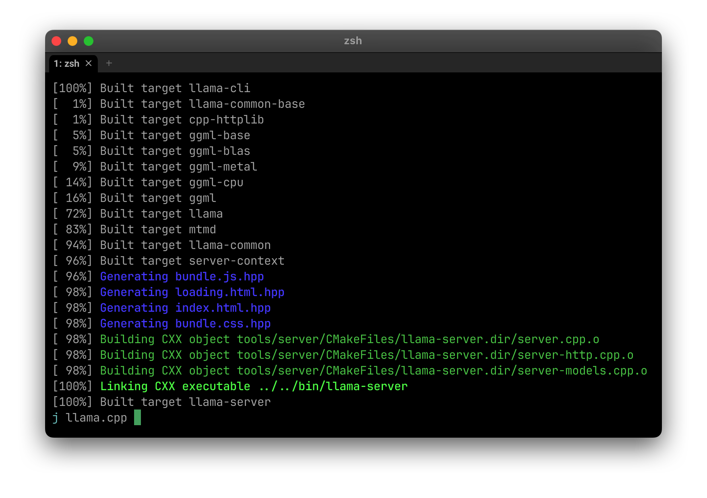
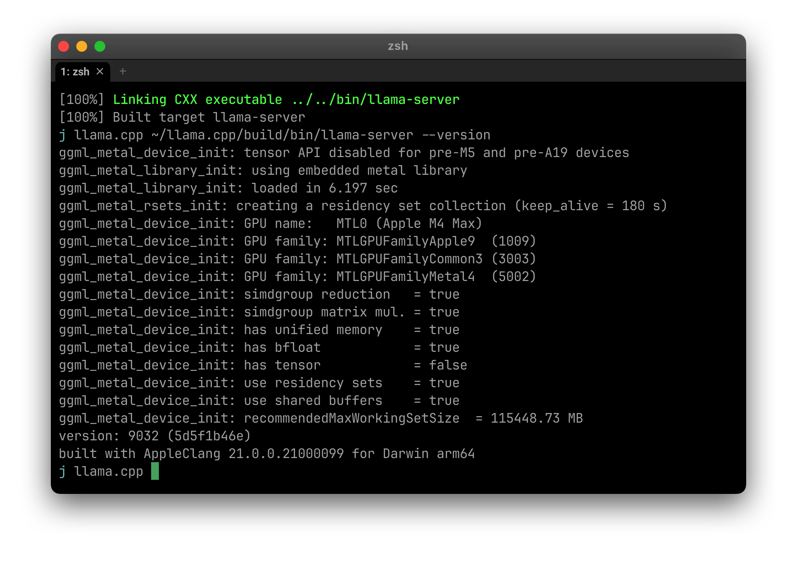
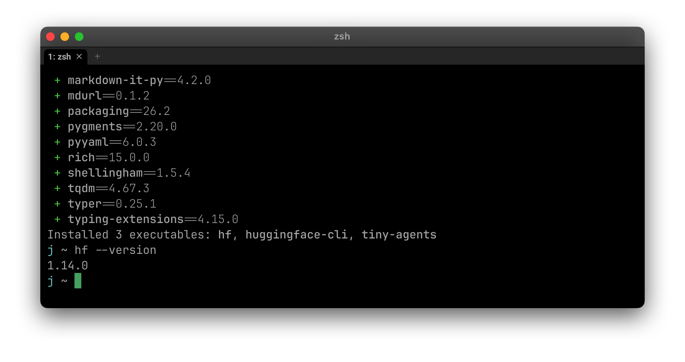
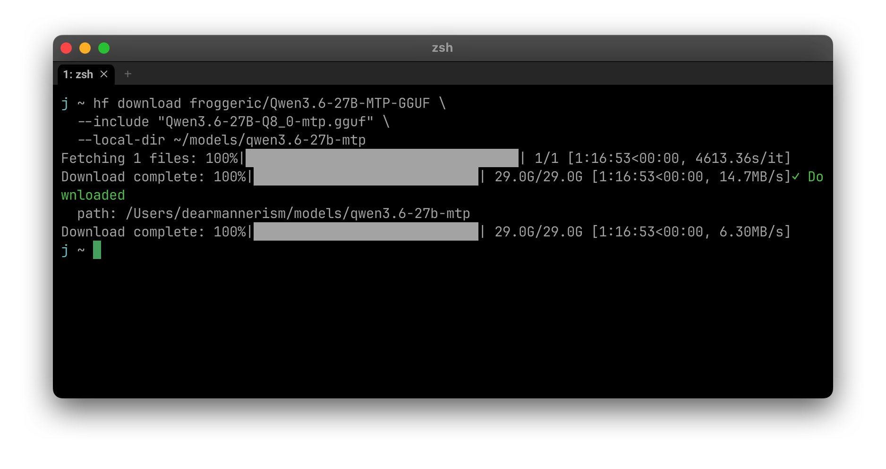
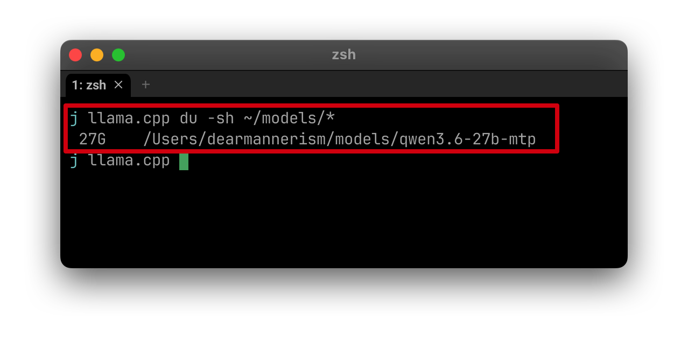
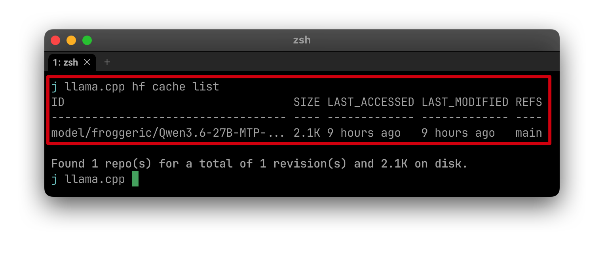
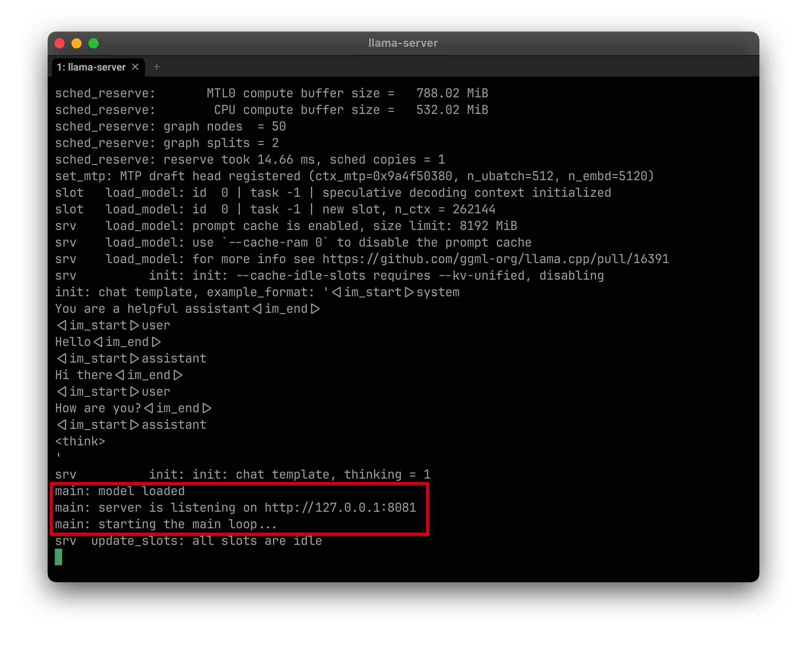
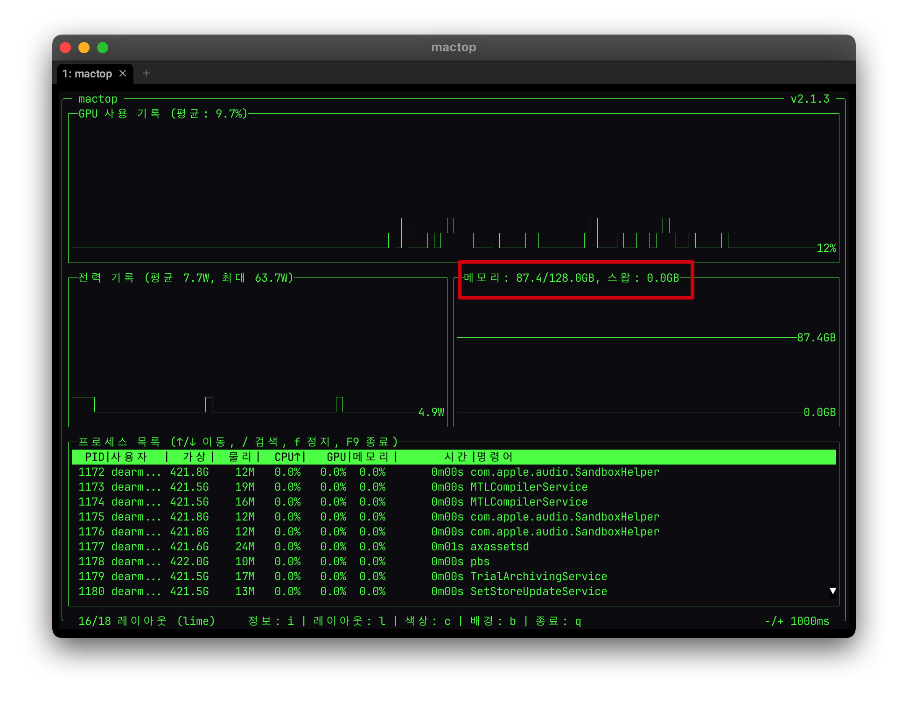
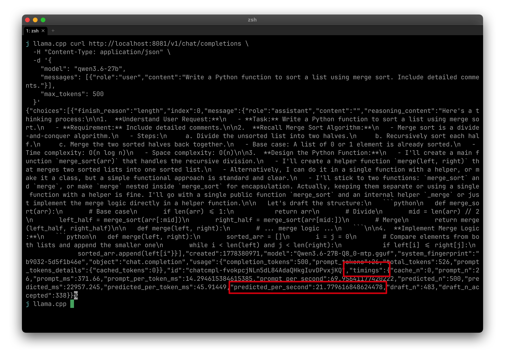
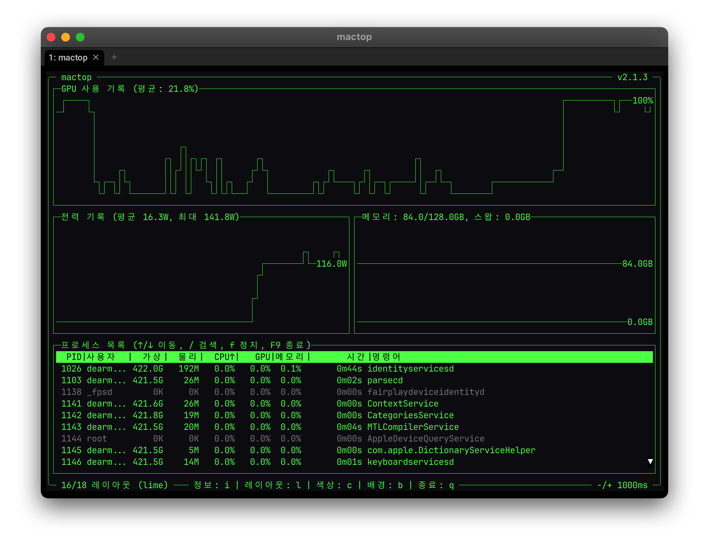

# 모델 받아서 돌리기 — Qwen 3.6 27B MTP (7편)

> 6편에서 정한 모델을 실제로 띄워서 돌려봅니다. M4 Max에서 Qwen 3.6 27B + MTP가 daily driver로 쓸 만한지 토큰 속도를 측정합니다.

## 사전 준비
- 1~6편 완료
- mactop 설치 (5편)

---

## 실험 흐름

```
1. llama.cpp PR #22673 빌드 (MTP 지원)
2. 모델 다운로드 (Q8_0 MTP)
3. MTP 실행 + 측정
4. 결과 정리 → 가설 검증
```

---

## 1. llama.cpp PR 빌드

### 왜 또 빌드?
2편의 brew llama.cpp는 **stable(안정) 버전**이라 MTP 지원 코드가 아직 없어요. MTP 지원은 **PR #22673**라는 pull request에 들어있는데, 2026-05-10 시점에 아직 머지 안 된 **draft** 상태예요. 사전 PR 두 개(#22787, #22838)가 먼저 끝나야 머지 가능. 그때까진 직접 그 브랜치를 빌드해서 써야 해요.

### 이게 뭐예요?
**llama.cpp의 stable(brew) 버전엔 아직 들어가지 않은 신기능**(예: MTP, 새 모델 지원)을 쓰고 싶을 때, 그 기능이 들어있는 pull request 브랜치를 직접 빌드하는 방법이에요.

### 언제 필요해요?
- stable에 없는 신기능을 빨리 쓰고 싶을 때
- PR이 머지 대기 중이라 brew 버전엔 안 들어와있을 때

추후 PR이 머지되면 `brew upgrade llama.cpp`로 통일하면 됩니다.

### brew 거랑 충돌하지 않아요

| 빌드 | 위치 | 용도 |
|---|---|---|
| brew (`brew install llama.cpp`) | `/opt/homebrew/bin/llama-server` | stable, 일반 용도 |
| PR 빌드 | `~/llama.cpp/build/bin/llama-server` | 신기능 전용 |

`llama-server`만 입력하면 brew 거가 잡히고, PR 빌드는 **절대경로로 호출**합니다. PATH 손댈 필요 없음.

### 사전 준비

```sh
brew install cmake git
```

### 빌드 절차

```sh
# 1. 홈 디렉토리로 이동
cd ~

# 2. 클론 + PR 브랜치 체크아웃 (PR번호는 상황에 맞게)
git clone --depth 1 https://github.com/ggml-org/llama.cpp.git
cd llama.cpp
git fetch origin pull/<PR번호>/head:<브랜치이름> && git checkout <브랜치이름>

# 3. Metal 가속 빌드 (Apple Silicon)
cmake -B build -DGGML_METAL=ON -DCMAKE_BUILD_TYPE=Release
cmake --build build --target llama-cli llama-server -j
```

빌드 시간: **5~10분**.


빌드 출력:


### 결과 확인

```sh
~/llama.cpp/build/bin/llama-server --version
```

`--version` 확인:

버전 정보 뜨면 성공.

---
## 2. 모델 다운로드

### 이게 뭐예요?
**Hugging Face에서 GGUF 모델 파일을 받아오는 CLI 방법이에요.**

### 설치

`uv`로 Hugging Face CLI(`hf`) 설치:

```sh
uv tool install huggingface_hub
```

설치 확인:

```sh
hf --version
```



### 다운로드

> ⚠️ **항상 `--include`로 필요한 파일만 받으세요.** GGUF 저장소엔 양자화별로 8~12개 파일이 있고 합치면 100GB 넘어요.

```sh
hf download froggeric/Qwen3.6-27B-MTP-GGUF \
  --include "Qwen3.6-27B-Q8_0-mtp.gguf" \
  --local-dir ~/models/qwen3.6-27b-mtp
```

다운로드가 끝나면 이런 식으로 표시돼요:


### 다운로드된 모델 확인

받은 모델은 두 군데에 있을 수 있어요:
- `--local-dir`로 지정한 위치 (예: `~/models/...`)
- Hugging Face 기본 캐시 (`~/.cache/huggingface/hub/`)

#### 직접 받은 위치 확인

```sh
du -sh ~/models/*
```

#### HF 캐시 확인

```sh
hf cache list
```

모델별 크기, 경로, 마지막 사용 시각이 표로 나와요.

### Gated 모델 (Llama 등)

일부 모델은 다운 전 라이선스 동의 + 토큰 필요해요.

1. 모델 페이지에서 "Request access" 클릭
2. https://huggingface.co/settings/tokens 에서 토큰 발급 (read 권한)
3. 로그인:
   ```sh
   hf auth login
   ```
   또는 환경변수: `export HF_TOKEN=hf_xxxxx`

### 더 알아보기
- [공식 문서](https://huggingface.co/docs/huggingface_hub/guides/cli)

### 이 편에서 받을 것

**Q8_0 MTP** (~27GB, M4 Max 128GB sweet spot):
```sh
hf download froggeric/Qwen3.6-27B-MTP-GGUF \
  --include "Qwen3.6-27B-Q8_0-mtp.gguf" \
  --local-dir ~/models/qwen3.6-27b-mtp
```

---

## 3. MTP 실행

### 이게 뭐예요?
**다운받은 GGUF 모델을 실제로 띄워서 돌려보는 방법이에요.** llama-server로 OpenAI 호환 API 서버를 띄우고, curl로 프롬프트 보내서 응답과 토큰 속도를 확인합니다.

### 준비물

- llama.cpp 설치 (brew 또는 PR 빌드)
- GGUF 모델 파일 (다운받은 위치)

### 3개 터미널로 진행

#### 터미널 A — llama-server 띄우기

```sh
~/llama.cpp/build/bin/llama-server \
  -m ~/models/qwen3.6-27b-mtp/Qwen3.6-27B-Q8_0-mtp.gguf \
  --spec-type mtp --spec-draft-n-max 3 \
  -np 1 -c 262144 \
  --temp 0.7 --top-k 20 \
  -ngl 99 \
  --port 8081
```

플래그 의미는 추론-엔진-플래그·가속-기술 참고.

> 💡 PR 빌드본은 **절대경로**(`~/llama.cpp/build/bin/llama-server`)로 호출해서 brew 거랑 충돌 안 함.

모델 로딩 1~2분 후 `server is listening on port 8081` 메시지 뜨면 준비 완료.


#### 터미널 B — mactop으로 시스템 모니터링

```sh
mactop
```

`l` 키로 시계열 그래프 레이아웃 전환. GPU%·전력·메모리·스왑 동시 확인.


#### 터미널 C — 테스트 프롬프트 보내기

```sh
curl http://localhost:8081/v1/chat/completions \
  -H "Content-Type: application/json" \
  -d '{
    "model": "qwen3.6-27b",
    "messages": [{"role":"user","content":"Write a Python function to sort a list using merge sort. Include detailed comments."}],
    "max_tokens": 500
  }'
```

응답이 JSON으로 반환돼요. 이런 식으로 길게 출력됩니다:



### 결과 읽기

#### 1. 토큰 속도 — JSON 응답의 `timings` 객체

응답 JSON 맨 끝에 `"timings"` 객체가 있어요. 여기에 핵심 숫자가 다 들어있습니다.

| 필드                     | 의미                                              |
| ---------------------- | ----------------------------------------------- |
| `prompt_per_second`    | **Prefill 속도** (입력 처리, tok/s)                   |
| `predicted_per_second` | **Generation 속도** (답 만드는 속도, tok/s) ← **핵심 지표** |
| `draft_n`              | MTP draft 토큰 시도 횟수                              |
| `draft_n_accepted`     | MTP draft 토큰 수락 횟수                              |

응답이 raw JSON이라 보기 어려우면 `predicted_per_second`로 검색하면 바로 찾을 수 있어요.

#### 2. 시스템 자원 — 터미널 B의 mactop

생성 중 정상 상태:

| 지표 | 정상 | 비정상 신호 |
|---|---|---|
| GPU 사용률 | 80~100% | 50% 이하 → CPU 도는 중 (`-ngl 99` 빠짐) |
| 전력 | 30~80W | 5W 유지 → 추론이 GPU에 안 올라감 |
| 메모리 + 스왑 | 모델 크기만큼, 스왑 0 | 스왑 1GB+ → 메모리 부족 |

생성 중 mactop은 이렇게 보여요 — GPU가 100%까지 치솟는 톱니 패턴, 전력 100W+ 도달:



### 종료

- llama-server: 터미널 A에서 `Ctrl+C`
- mactop: 터미널 B에서 `q`

### 시험 결과 (M4 Max 128GB + Qwen 3.6 27B MTP Q8_0)

같은 프롬프트(`Write a Python merge sort function with comments.`, max_tokens=500)로 6번 반복 측정.

| Run | KV 캐시 | Prefill (tok/s) | Generation (tok/s) | MTP 수락률 |
|---|---|---|---|---|
| 1 | f16 | 29.19 | 22.65 | 343/465 (73.8%) |
| 2 | f16 | — | 23.94 | (79.8%) |
| 3 | q8_0 | — | 22.77 | (76.1%) |
| 4 | q8_0 | 72.04 | 23.51 | 350/444 (78.8%) |
| 5 | f16 | 68.98 | 23.83 | 351/444 (79.1%) |
| 6 | f16 | 69.96 | 21.78 | 338/483 (70.0%) |

**평균 ≈ 23 tok/s, MTP 수락률 ~76%.** KV 양자화는 메모리만 절감(87→79 GB), 속도엔 영향 없음.

#### 시스템 자원 (생성 중)

| 지표 | 측정값 |
|---|---|
| GPU 사용률 | 평균 27%, peak 100% (톱니 패턴) |
| 전력 | 평균 25W, peak 141.8W |
| 메모리 | 79~87 GB (KV f16/q8_0 따라) |
| 스왑 | 0 GB (헤드룸 충분) |

#### 가설 vs 실측

- 가설: 35~40 tok/s
- 실측: ~23 tok/s ⚠️ 부분적 성공
- 저자 측정치(M2 Max 96GB → 28 tok/s) 대비도 낮음
- 추정 원인: PR #22673이 active development 중이라 빌드 시점에 따라 M4 Max에서 MTP 효율 차이 발생. PR 머지 후 재측정 필요.

#### 결론
**23 tok/s도 daily driver로 충분** (사람 읽기 속도의 3배). 코딩 어시스턴트 워크로드에 OK.

### 더 알아보기
- [llama-server 공식 문서](https://github.com/ggml-org/llama.cpp/tree/master/tools/server)
- [OpenAI 호환 API 명세](https://platform.openai.com/docs/api-reference/chat)

**예상 generation: 35~40 tok/s** (저자 M2 Max 28 tok/s × M4 Max 대역폭 비율 1.36)

---

## 4. 실측 결과

다섯 번 반복 측정 (셋업·KV 캐시 변경 포함):

| Run | KV | Generation (tok/s) | MTP 수락률 |
|---|---|---|---|
| 1 | f16 | 22.65 | 73.8% |
| 2 | f16 | 23.94 | 79.8% |
| 3 | q8_0 | 22.77 | 76.1% |
| 4 | q8_0 | 23.51 | 78.8% |
| 5 | f16 | 23.83 | 79.1% |

**평균 ~23 tok/s.** KV 캐시 양자화는 메모리(87→79GB) 절감만 있고 속도엔 영향 없음.

GPU·전력:
- GPU 사용률: 평균 27%, peak 100% (스파이크-아이들 톱니 패턴)
- 전력: peak 141.8W, 평균 25W
- 메모리: 79~87GB (스왑 0)

---

## 5. 가설 검증

### 가설
M4 Max에서 Qwen 3.6 27B + MTP = 35+ tok/s 달성 가능, daily driver로 충분

### 결과 — ⚠️ 부분적 성공

- 측정값 **23 tok/s**는 가설(35+) 미달
- 저자 M2 Max 측정치(28 tok/s)에도 못 미침 (M4 Max가 대역폭 1.36x 높음에도)
- 다만 **사람 읽기 속도의 3배 + 베이스라인 대비 ~1.5x 가속 확인** → daily driver로는 사용 가능

### 격차의 원인 (추정)

1. **PR 커밋 드리프트** — 저자 빌드(2026-05-07) vs 우리 빌드(2026-05-10) 사이 커밋이 M5+ tensor API 최적화 위주로 변경되면서 M4 fallback 경로가 비효율적이 됐을 가능성
2. **MTP 가속률 차이** — 저자 2.5x, 우리 ~1.5x. PR 머지될 때 다시 측정 필요

### 결론
**Qwen 3.6 27B MTP를 daily driver로 채택.** 23 tok/s에서 안정적으로 작동, 추후 PR 머지 시 재측정.

---

## 다음 편 예고

이 결과로 daily driver 모델이 정해지면, 다음 편:
- 코딩 어시스턴트 (Cline/Continue.dev) 연결
- Claude Code 대용 셋업

---

## 참고 자료
- [r/LocalLLaMA — ex-arman68의 원본 글](https://www.reddit.com/r/LocalLLaMA/comments/1t57xuu/25x_faster_inference_with_qwen_36_27b_using_mtp/)
- [froggeric/Qwen3.6-27B-MTP-GGUF](https://huggingface.co/froggeric/Qwen3.6-27B-MTP-GGUF)
- [llama.cpp PR #22673](https://github.com/ggml-org/llama.cpp/pull/22673)
- [Qwen 3.6 27B + MTP 분석 — The Coders Blog](https://thecodersblog.com/faster-llm-inference-with-qwen-3-6-27b-and-mtp-2026/)

---

*이 페이지의 원본은 Obsidian vault `Personal/LocalLLM/7-model-run/index.md` 에서 동기화됩니다.*
