# 터미널 코딩 에이전트 고르기 (8편)

> 7편에서 Qwen 3.6 27B MTP를 daily driver로 정했어요. 이제 이 모델을 **Claude Code 대용**으로 굴릴 터미널 에이전트가 필요합니다. 후보를 잠깐 훑어 픽을 정하고, 그대로 설치·연결까지 갑니다.

## 사전 준비
- 7편 완료 (`localhost:8081`에서 llama-server 가동 중)

---

## 후보들

요즘 자주 거론되는 터미널 코딩 에이전트는 대충 이런 것들이 있어요.

| 도구 | 한 줄 요약 |
|---|---|
| **aider** | OG 터미널 에이전트, git 통합 최강, 가장 안정 |
| **OpenCode** | SST 팀, 95K stars, 75+ provider 지원 |
| **OpenAgent** | Claude Code drop-in 대체 표방, 셋업 마법사 |
| **Pi** | 미니멀 harness, "primitives over features" |

---

## 우리에게 중요한 기준

이 시리즈는 단순히 "Claude Code 따라하기"가 아니라, **로컬 LLM을 내 워크플로에 맞춰 깊게 다루는 것**이 목표예요. 그래서 다음 두 가지를 가장 우선합니다.

1. **커스터마이즈 가능성** — 프롬프트·도구·세션 흐름을 직접 바꿀 수 있는가
2. **미니멀함** — "기능 풀세트"보다 필요한 것만 골라 쌓는 구조

이 둘을 둘 다 만족하는 건 **Pi**예요.

- aider는 안정적이지만 정해진 워크플로를 따라가야 함
- OpenCode는 화려하지만 75+ provider 지원하느라 config가 무거움
- OpenAgent는 Claude Code UX 모방이라 친숙하지만 결국 "Claude Code의 또 다른 버전"

Pi는 시작이 황량하지만, **TypeScript로 본인만의 에이전트를 빌드해 가는 구조**라 시리즈의 학습 목적과 잘 맞아요.

---

## Pi란

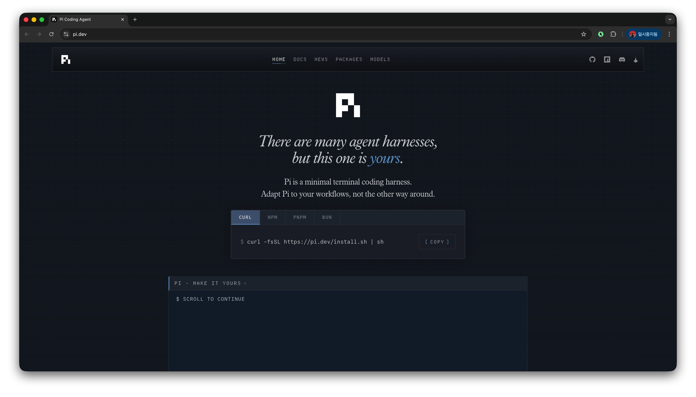
### 이게 뭐예요?
**최소 터미널 코딩 harness예요.** 다른 도구들이 "기능 풀세트"를 제공한다면 Pi는 **"primitives, not features"** 철학으로 미니멀하게 시작해서 본인 워크플로에 맞춰 확장하는 접근입니다.

- 공식: https://pi.dev
- 라이선스: MIT
- 만든 곳: Earendil Inc.

### 강점

- **미니멀 — 본인이 원하는 만큼만 빌드**
- **TypeScript 확장 가능** — extensions, skills, prompt templates, themes 다 커스텀
- **4가지 동작 모드**:
  - 인터랙티브 TUI
  - print/JSON 출력 (CI·자동화 용)
  - RPC
  - SDK (다른 도구에 임베드)
- **트리 구조 세션 히스토리** — 대화를 트리로 분기·병합
- **15+ provider** + **custom provider 직접 추가 가능** ← llama-server 직접 연결 OK
- **Mid-session 모델 전환** — 대화 중 모델 바꾸기

### 약점

- **러닝 커브** — "다 직접 빌드"라 처음엔 황량함
- **사용자 베이스 작음** — 신생 도구
- **plan mode·permission system 같은 사전 빌드 기능 없음** — 직접 만들어야 함
### 우리가 Pi를 고른 이유

Pi가 후보 중에서 **가장 미니멀하고, 개발이 깔끔하게 잘 된 느낌**이라서 골랐어요. OpenCode를 잠깐 써봤는데 코드베이스에 쓸데없는 게 덕지덕지 붙어 있어서 살짝 무겁고 느리다는 인상을 받았어요. Pi는 그 반대로, **필요한 걸 하나씩 직접 붙여 가는 구조**라 그 과정에서 배우는 것도 많을 거라고 봅니다. 그래서 이 시리즈는 Pi로 갑니다.

---

## Pi 설치

### 1. Node.js + pnpm 설치

Pi는 Node.js로 만들어진 도구라 Node와 패키지 매니저가 필요해요. 보통은 `npm`을 쓰지만, 이 시리즈에서는 **pnpm**을 씁니다.

> **왜 pnpm?** 같은 패키지를 디스크에 한 번만 저장하고 프로젝트마다 링크해서 쓰는 구조라, **설치가 빠르고 디스크를 덜 먹어요.** 명령어도 npm과 거의 똑같아서 옮겨가도 부담이 없습니다.

Homebrew로 한 번에 설치:
```sh
brew install node pnpm
```

> `pnpm`은 Node 위에서 도는 도구라 **Node도 같이 깔아야 작동합니다.** `pnpm`만 깔면 `env: node: No such file or directory` 에러가 납니다.

확인:
```sh
node --version
pnpm --version
```
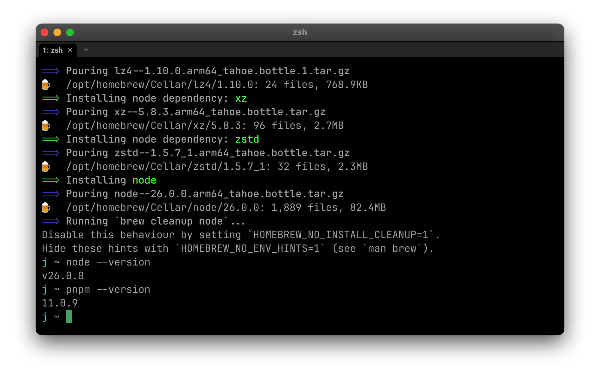
### 2. pnpm global PATH 설정

pnpm은 글로벌 패키지를 `~/Library/pnpm/bin`에 깔아요. 이 폴더가 `PATH`에 없으면 설치한 명령어를 못 부르니, 한 번만 셋업해 둡니다.

```sh
pnpm setup
source ~/.zshrc
```

`pnpm setup`이 `~/.zshrc`에 `PNPM_HOME`과 `PATH` export를 자동으로 추가해 줍니다. `source`로 현재 셸에 바로 반영해 두면 됩니다.

> 안 깔면 `pnpm add -g ...` 실행 시 `The configured global bin directory ... is not in PATH` 에러가 납니다.

### 3. Pi 설치

```sh
pnpm add -g @earendil-works/pi-coding-agent
```

설치 도중 이런 프롬프트가 뜹니다:

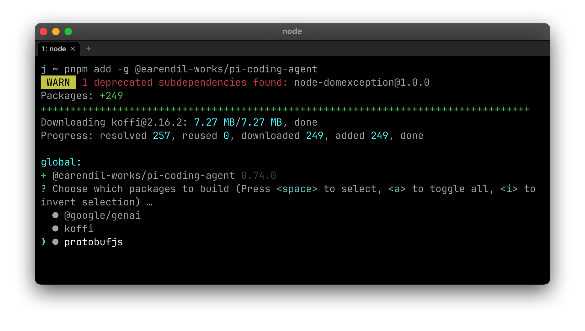

pnpm 11부터는 보안상 **빌드 스크립트를 실행할 패키지를 직접 골라야** 합니다. **스페이스로 전부 선택한 뒤 Enter**를 누르세요. 각 패키지의 역할은 이렇습니다.

- **koffi** — C FFI 바인딩. 빌드 안 하면 Pi가 시스템 호출을 못 해서 동작이 깨집니다 (필수).
- **@google/genai** — Google GenAI SDK. provider 옵션 중 하나.
- **protobufjs** — Protobuf 런타임. 메시지 직렬화에 사용.

전부 정식 패키지라 안전합니다.

선택 후엔 한 번 더 확인 프롬프트가 뜹니다:

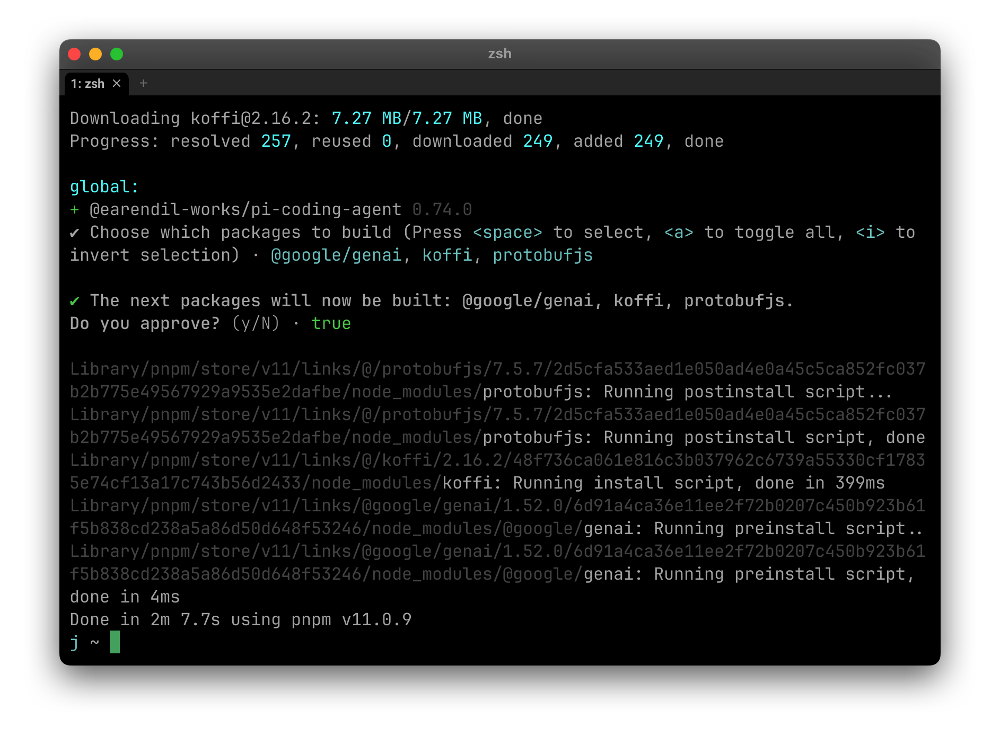

**디폴트가 `N`**이라 그냥 Enter 누르면 빌드가 안 됩니다. `y` + Enter로 명시 승인하세요. 완료되면 `Done in N s using pnpm v11.x.x` 메시지가 나옵니다.

확인:
```sh
pi --version
```

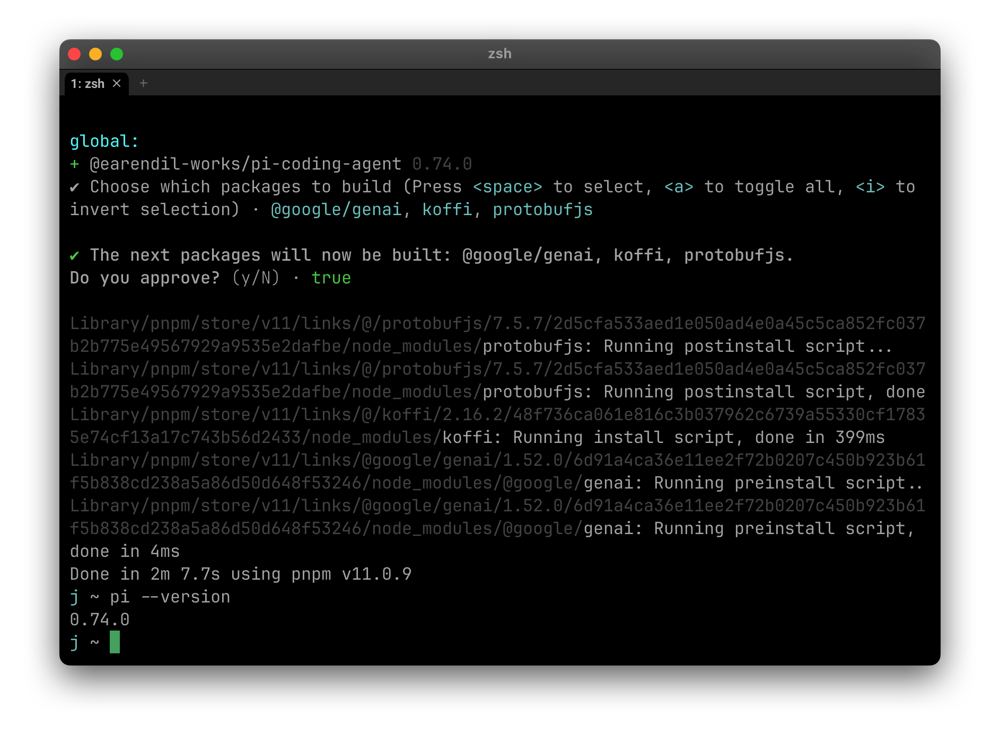
Pi 설치 완료.

---

## llama-server 연결

Pi는 `~/.pi/agent/models.json`에서 커스텀 provider를 읽습니다. llama-server는 OpenAI 호환 API라서 `api: "openai-completions"`로 등록하면 됩니다.

### 1. 설정 폴더 만들기

```sh
mkdir -p ~/.pi/agent
```
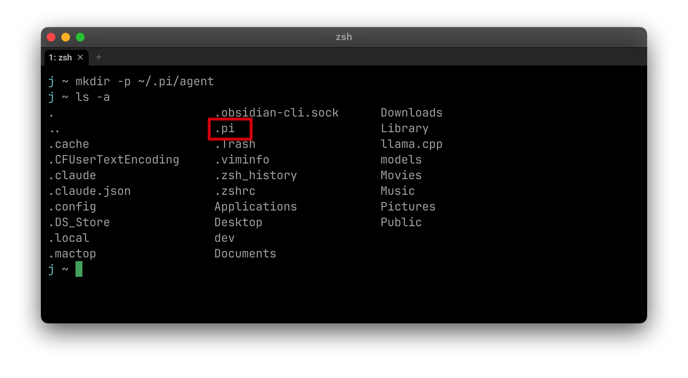
### 2. models.json 생성

아래 한 덩어리를 그대로 터미널에 붙여넣으면 파일이 만들어집니다.

```sh
cat > ~/.pi/agent/models.json <<'EOF'
{
  "providers": {
    "local-llama": {
      "baseUrl": "http://localhost:8081/v1",
      "api": "openai-completions",
      "apiKey": "dummy",
      "models": [
        {
          "id": "qwen3.6-27b",
          "name": "Qwen 3.6 27B MTP (Local)",
          "reasoning": false,
          "input": ["text"],
          "contextWindow": 262144,
          "maxTokens": 32000,
          "cost": { "input": 0, "output": 0, "cacheRead": 0, "cacheWrite": 0 }
        }
      ]
    }
  }
}
EOF
```

> `contextWindow`는 7편에서 llama-server에 준 `-c 262144`와 맞춰요. `apiKey`는 llama-server가 인증을 요구하지 않아서 아무 문자열이면 됩니다.
> 
### 3. 파일 확인

```sh
cat ~/.pi/agent/models.json
```

위에 붙여 넣은 JSON이 그대로 출력되면 성공.
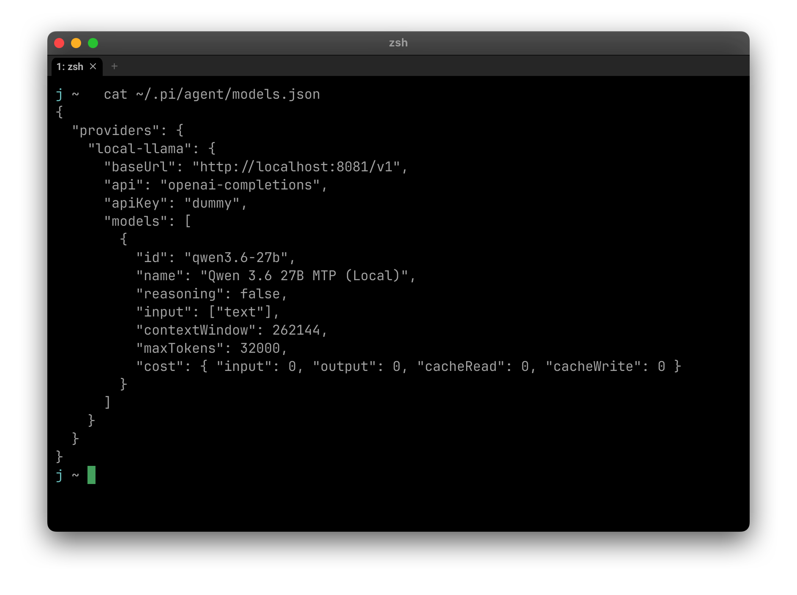

### 터미널 두 개 띄우기

이제부터는 터미널을 **두 개** 사용합니다.

- **터미널 A** — llama-server를 띄워 두는 곳. 모델 추론이 도는 백엔드라 켜져 있어야 Pi가 요청을 보낼 수 있어요.
- **터미널 B** — Pi를 실행하는 곳. 우리가 실제로 코딩 작업을 하는 화면.

둘은 같은 머신 안에서 `localhost:8081`로 통신합니다.

### 4. (터미널 A) llama-server 가동

새 터미널을 하나 열고 다음 명령어를 실행하세요. 이 창은 **닫지 말고 그대로 두세요.**

```sh
~/llama.cpp/build/bin/llama-server \
  -m ~/models/qwen3.6-27b-mtp/Qwen3.6-27B-Q8_0-mtp.gguf \
  --spec-type mtp --spec-draft-n-max 3 \
  -np 1 -c 262144 \
  --temp 0.7 --top-k 20 \
  -ngl 99 --port 8081
```

`server is listening on ...:8081` 메시지가 나오면 준비 완료.

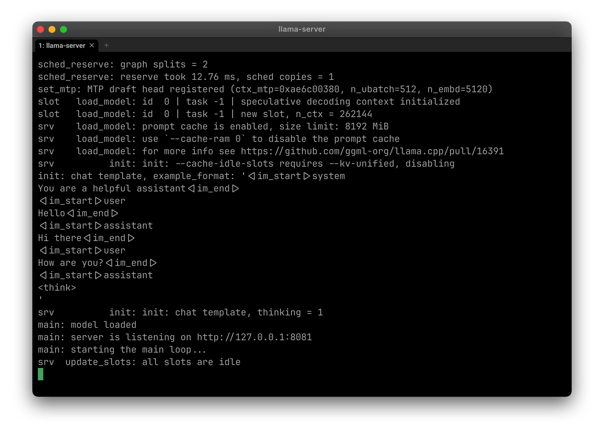
### 5. (터미널 B) Pi 실행

**다른 터미널을 새로 띄워서** 작업할 프로젝트 디렉터리로 이동:

```sh
cd ~/your-project
```

Pi 띄우기:

```sh
pi
```

처음 실행하면 초기 설정 화면이 몇 번 뜹니다 (작업 디렉터리 확인, 테마 선택 등). 기본값으로 그대로 넘기면 돼요.

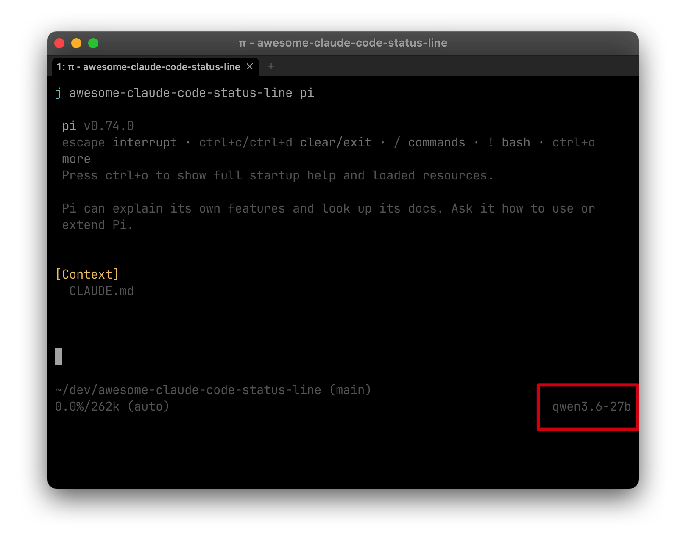

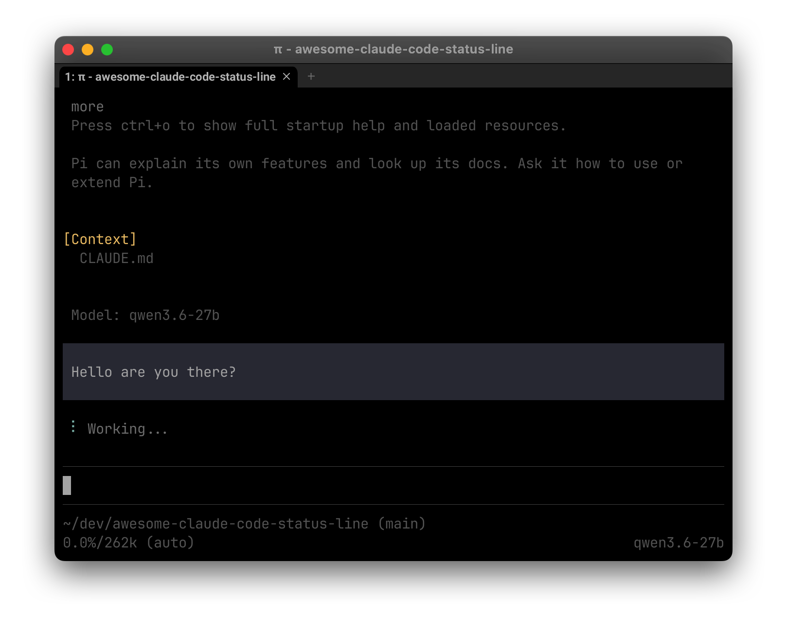

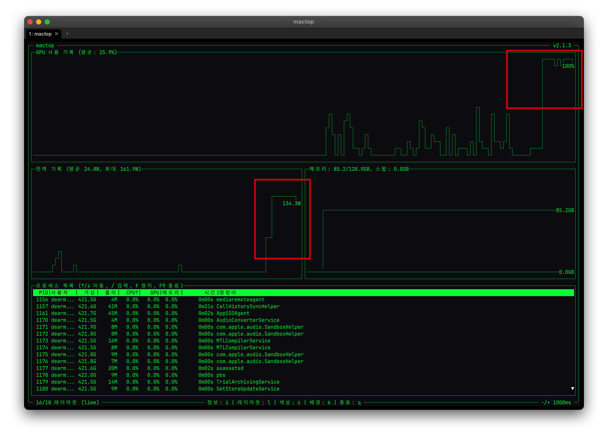

#### 화면 읽는 법

하단 상태바를 확인하세요.

- **왼쪽 위** — 작업 디렉터리와 git 브랜치 (`~/dev/프로젝트명 (main)`)
- **왼쪽 아래** — 컨텍스트 사용량 (`0.0%/262k (auto)`). `262k`는 `models.json`의 `contextWindow`와 일치
- **오른쪽 아래** — 현재 모델명. **`qwen3.6-27b`로 표시되면 우리 llama-server에 정상 연결된 것**

`models.json`에 provider가 하나만 있을 땐 Pi가 자동으로 그 모델을 선택해요. 별도로 `/model`을 부를 필요가 없습니다.

### 6. (선택) 모델 바꾸기

나중에 provider·모델을 늘렸을 때 세션 안에서 전환:

```
/model
```

`models.json`은 `/model`을 부를 때마다 다시 읽어서 **재시작 없이 수정·추가가 됩니다.**

### 7. 첫 프롬프트 던지기

테스트로 한번 현재 프로젝트 디렉터리를 읽어 보라고 시켜 봤어요.

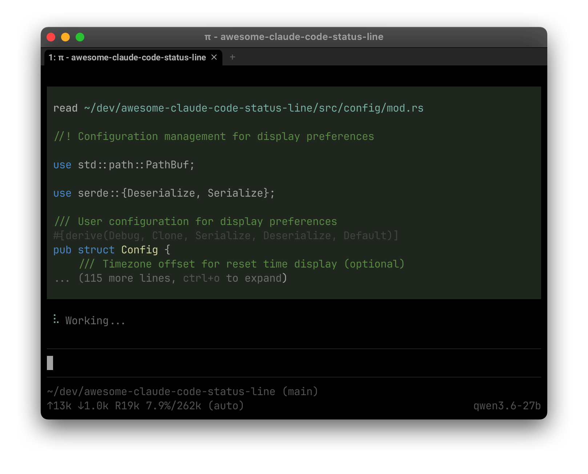

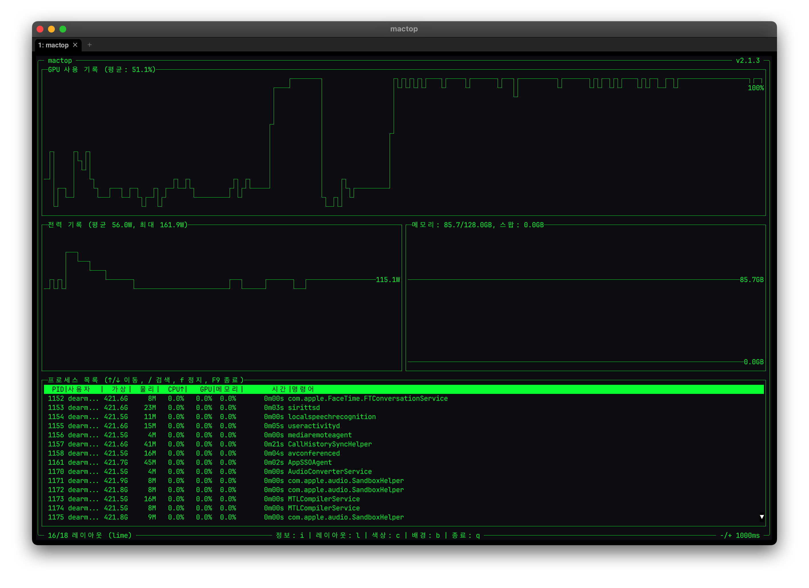

응답이 정상적으로 흘러나오면 Pi + Qwen 3.6 27B MTP 셋업은 끝.

#### 진짜로 돌아갑니다 — 발열·소음 주의

추론이 시작되자마자 **GPU 사용률 99%**, 맥북 팬은 **100%로 풀가동**됩니다. 살면서 맥북 프로 팬 소리를 이렇게 크게 들어본 건 처음일 거예요. 본체도 빠르게 뜨거워지고요.

> 27B 모델을 풀로 돌리면 사실상 **냉장고 급 전기**를 빨아먹는 셈이에요. 다음을 추천합니다.
> - 노트북을 **무릎 위에 올려놓지 말 것** (저온화상 위험)
> - **통풍 되는 평평한 곳** + 가능하면 **노트북 스탠드**
> - 장시간 작업이면 **전원 연결** (배터리 빠른 속도로 닳음)
> - 발열이 신경 쓰이면 7편의 `-c` 값을 낮추거나, 더 작은 모델로 잠시 전환해 보세요

---

## 동작 확인

터미널 두 개를 띄웁니다.

**터미널 A — llama-server**
```sh
~/llama.cpp/build/bin/llama-server \
  -m ~/models/qwen3.6-27b-mtp/Qwen3.6-27B-Q8_0-mtp.gguf \
  --spec-type mtp --spec-draft-n-max 3 \
  -np 1 -c 262144 \
  --temp 0.7 --top-k 20 \
  -ngl 99 --port 8081
```

**터미널 B — Pi**
```sh
cd ~/your-project
pi
```

세션 안에서:
```
/model
```
→ `local-llama / qwen3.6-27b` 선택

이제 Pi 프롬프트에 코딩 작업을 던지면 로컬 Qwen으로 처리됩니다.

---

## 속도 향상시키기

7편 셋업 그대로 Pi에 붙여 보면 체감 속도가 의외로 느릴 수 있어요. 컨텍스트 누적, 무한 thinking, 깨진 chat template 같은 함정들이 있습니다. 아래에서 한 번에 정리.

7편의 명령어 그대로 돌렸을 때, Pi에서 실제로 코딩 작업을 시켜 보면 **체감 속도가 의외로 느립니다.** 7편 시험의 23 tok/s가 아니라 15 tok/s, 심하면 12 tok/s 정도. 이유와 개선 방법을 정리합니다.

### 왜 느려졌나? — 세 가지 원인

#### 1. 컨텍스트 누적

7편 시험은 `hello` 같은 **거의 빈 컨텍스트**(수백 토큰)였어요. Pi는 다릅니다.

- 시스템 프롬프트 + 도구 정의 → 약 3~5K 토큰
- `CLAUDE.md` 자동 로드 → 프로젝트마다 다름
- 이전 세션 이어가기 → 수천~수만 토큰
- 도구 호출 결과 → 매 턴 추가됨

매 토큰을 생성할 때 KV cache 전체를 스캔하니까, **컨텍스트가 클수록 tok/s가 떨어져요.** 32K 컨텍스트면 15 tok/s, 64K면 그보다 더 느림.

#### 2. Thinking이 무한대

llama-server 기본 설정에선 Qwen 3.6의 reasoning budget이 **`2147483647`(INT_MAX)** 로 잡혀 있어요. 즉 "hello" 같은 단순 질문에도 thinking을 1000~5000 토큰씩 만들 수 있습니다.

- thinking은 사용자가 답을 보기 **전까지** 만들어짐 → 첫 토큰 지연 큼
- 모델은 답을 잘 내지만, 체감엔 "왜 이렇게 느려?"

#### 3. Tool Call 깨짐 (간헐적)

공식 Qwen chat template은 vLLM(Python) 전용 문법이 있어서 llama.cpp(C++)에선 일부 도구 호출이 깨집니다. 우리 Pi가 tool 위주로 도는 에이전트라 직격탄.

→ 모델이 도구를 부르려다 형식 오류로 재시도 반복 → 시간 낭비

---

### 개선 방법

#### 1단계 (필수) — Fixed Chat Template 적용

##### 그 전에 — Chat Template이란?

우리는 Pi에서 한국어·영어로 자연스럽게 대화하지만, **모델 내부는 그렇게 받지 않아요.** 모델은 다음과 같은 특수 토큰이 섞인 "포맷팅된 텍스트"로 입력을 받습니다.

```
<|im_start|>system
너는 코딩 도우미야.<|im_end|>
<|im_start|>user
이 함수 리팩토링해 줘.<|im_end|>
<|im_start|>assistant
<|think|>먼저 함수 구조를 보자...<|/think|>
네, 이렇게 바꾸면...
```

`<|im_start|>`, `<|im_end|>`, `<|think|>` 같은 토큰은 모델이 학습할 때 본 **약속된 마커**예요. 모델은 이 마커를 보고 "여기서부터 system 메시지구나", "이제 내가 답할 차례구나"를 압니다.

**Chat Template은 사용자/도구가 보낸 일반 메시지들을 → 이 포맷팅된 텍스트로 변환하는 규칙**이에요. 보통 **Jinja2** 문법으로 작성된 텍스트 파일이고, 모델 GGUF 파일 안에 같이 들어 있어요. llama-server는 요청이 들어오면:

```
[
  {"role": "system", "content": "..."},
  {"role": "user", "content": "..."},
  {"role": "tool", "content": "..."}
]
```

이걸 받아 → chat template으로 포맷팅 → 모델에 넣음.

##### 왜 따로 고친 버전이 필요한가?

Qwen 공식 template은 **vLLM(Python 기반 서버)에 최적화**돼 있어서 Python 전용 Jinja 문법을 씁니다. llama.cpp는 C++로 만들어진 다른 Jinja 엔진을 쓰는데, 이게 일부 Python 문법을 못 알아들어요. 결과는:

- tool call 호출이 빈 인자로 나가거나 깨짐
- 빈 thinking 블록이 매 턴 누적
- 일부 메시지 패턴에서 서버가 크래시

[froggeric/Qwen-Fixed-Chat-Templates](https://huggingface.co/froggeric/Qwen-Fixed-Chat-Templates) — 공식 template의 7가지 버그를 고친 drop-in 교체본. **무조건 적용하세요.**

| # | 고친 문제 |
|---|---|
| 1 | C++ 엔진에서 tool call 깨짐 (`\|items` Python 전용 필터) ← 우리에게 직격 |
| 2 | OpenAI 호환 API의 `developer` role 거부 |
| 3 | 빈 thinking 블록이 컨텍스트에 누적 |
| 4 | thinking on/off 토글 (`<\|think_off\|>` 프롬프트에 삽입) |
| 5 | Qwen 3.6의 `</thinking>` 오타 파싱 |
| 6 | tool result만 있는 메시지일 때 크래시 (agentic loop 보호) |
| 7 | thinking 안 닫고 tool call → 자동 보정 |

**다운로드:**

```sh
mkdir -p ~/llama.cpp/templates
hf download froggeric/Qwen-Fixed-Chat-Templates \
  --include "qwen3.6/chat_template.jinja" \
  --local-dir ~/llama.cpp/templates
```

다운로드 완료 화면:

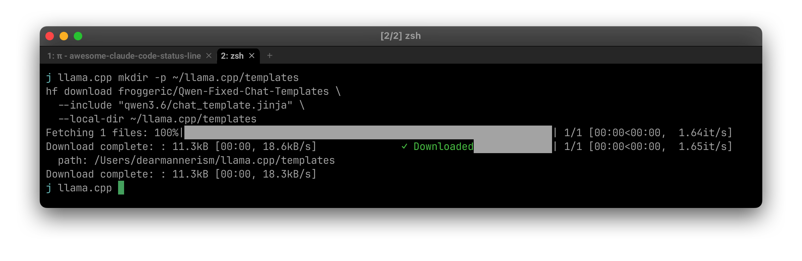

**적용:** 터미널 A에서 기존 llama-server를 Ctrl+C로 끄고, 아래 **전체 명령어로 다시 실행**.

```sh
~/llama.cpp/build/bin/llama-server \
  -m ~/models/qwen3.6-27b-mtp/Qwen3.6-27B-Q8_0-mtp.gguf \
  --spec-type mtp --spec-draft-n-max 3 \
  --jinja \
  --chat-template-file ~/llama.cpp/templates/qwen3.6/chat_template.jinja \
  -np 1 -c 262144 \
  --temp 0.7 --top-k 20 \
  -ngl 99 --port 8081
```

> 7편 명령어와 비교하면 **`--jinja`**와 **`--chat-template-file`** 두 줄만 추가됐어요. 나머진 그대로.

##### 실제 측정 결과

같은 머신(M4 Max 128GB), 같은 모델(Q8_0 MTP), 같은 Pi 셋업으로 비교했습니다. Pi 푸터의 `tok/s` 익스텐션 기준.

**1) Fixed Template 적용 직후 (첫 응답)**

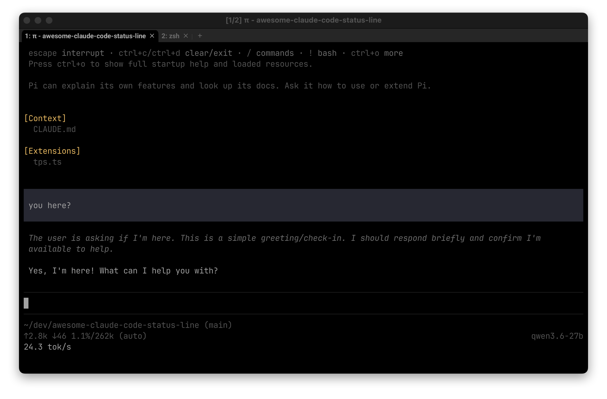

서버가 새로 떴고 Pi가 처음 실행되는 시점이라 cold start 영향이 살짝 있어요. 그래도 default template 시절의 12 tok/s보다 확실히 빠릅니다.

**2) 두 번째 응답 — 19.1 tok/s**

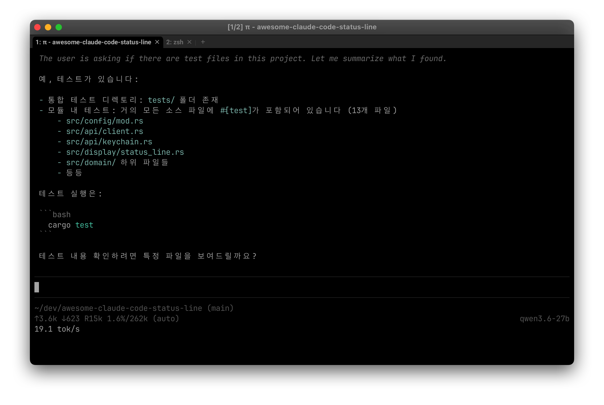

KV 캐시 워밍업이 끝나고 정상 흐름. 푸터 아래쪽에 **`19.1 tok/s`**.

**3) 세 번째 응답 — 23.3 tok/s**

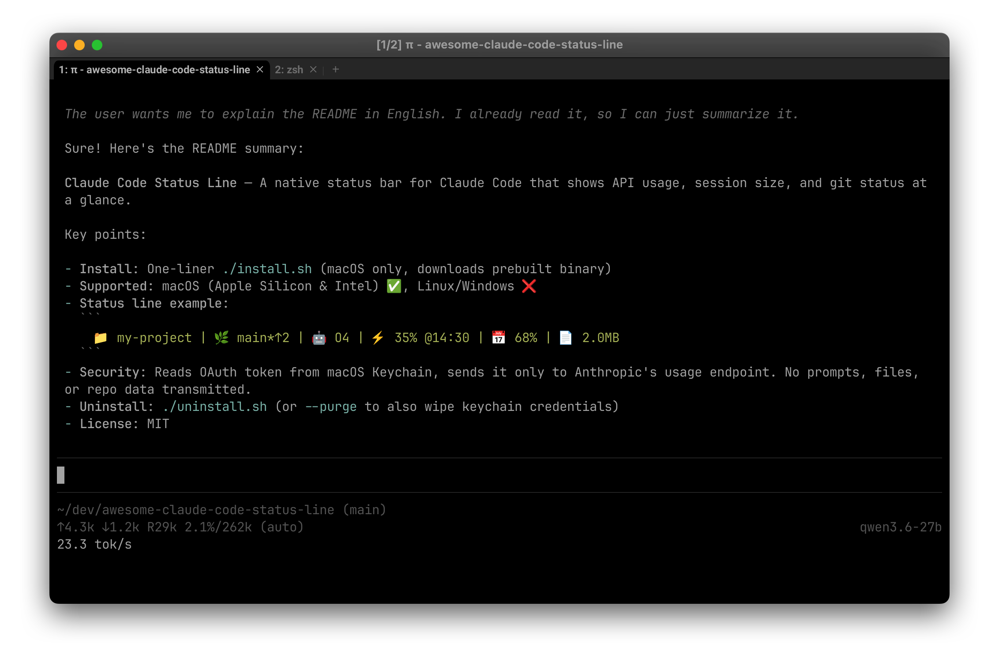

README 요약처럼 **구조화된 출력**에선 MTP draft 수용률이 올라가서 속도가 더 잘 나옵니다. 푸터 **`23.3 tok/s`**, 7편의 베이스라인을 회복하고 저자의 M2 Max 28 tok/s에 근접한 수치.

##### 정리

| 시점 | Pi 푸터 tok/s | 변화 |
|---|---|---|
| Default template + 32K 컨텍스트 누적 | 12.2 | baseline |
| Fixed template, 첫 응답 (cold) | 14~16 | — |
| Fixed template, 정상 흐름 | **19~23** | **+60~90%** |

Template만 바꾼 게 아니라 새 세션으로 컨텍스트가 깨끗했던 영향도 같이 섞여 있지만, 어쨌든 **Fixed Template은 손해 볼 게 없으니 무조건 적용**.

---

## 다음 편 예고
- 9편: 실제 코딩 작업으로 Pi + Qwen 3.6 27B 검증, 필요한 extension·skill 추가

---

## 참고 자료
- [Pi — pi.dev](https://pi.dev)
- [Pi Custom Models docs](https://pi.dev/docs/latest/models)
- [Pi Custom Provider docs](https://pi.dev/docs/latest/custom-provider)
- [froggeric/Qwen-Fixed-Chat-Templates](https://huggingface.co/froggeric/Qwen-Fixed-Chat-Templates)

---

*이 페이지의 원본은 Obsidian vault `Personal/LocalLLM/8-terminal-agent/index.md` 에서 동기화됩니다.*
