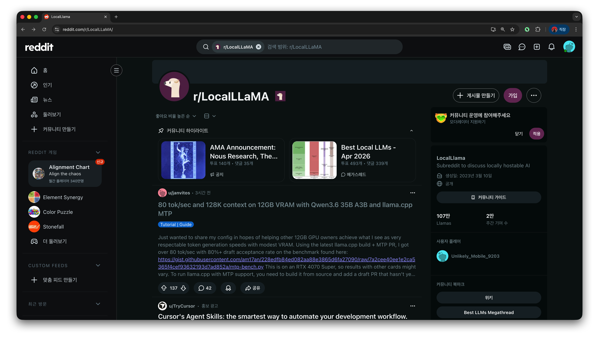
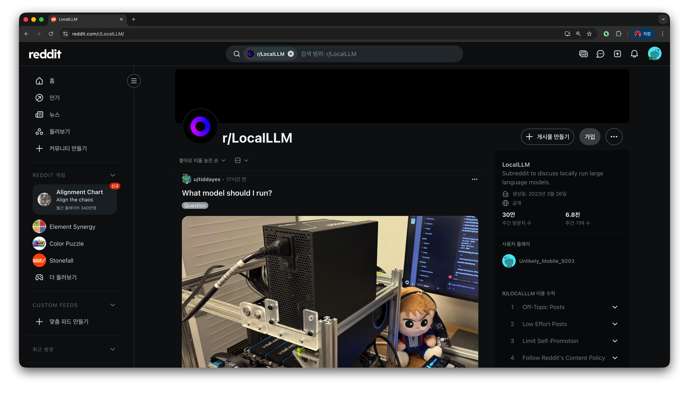

# community resources

## 커뮤니티 리소스 {#primitive-커뮤니티-리소스}

<!-- SYNC:BEGIN src="99-community-resources/primitives/커뮤니티-리소스.md" demote="1" -->
### 이게 뭐예요?
**로컬 LLM 정보는 공식 발표보다 커뮤니티가 훨씬 빠르고 실용적이에요.** 새 모델이 나왔을 때 "내 맥북에서 몇 tok/s 나왔다", "이 양자화는 품질이 떨어진다", "이 셋팅이 더 빠르다" 같은 실측 정보가 매일같이 올라옵니다. 이런 정보는 공식 문서로는 얻을 수 없어요.

이 글에서는 주로 참고하는 **해외 커뮤니티**를 소개합니다.

### 1. r/LocalLLaMA (메인)

**가장 활발하고 최신 정보가 빠른 커뮤니티예요.** 로컬 LLM에 관심 있다면 거의 매일 들어가게 됩니다.

- URL: https://www.reddit.com/r/LocalLLaMA/
- 매일 새 모델 후기, 벤치마크, 셋팅 팁이 올라옴
- 칩별 토큰 속도 공유 ("M4 Max에서 Qwen 3.6 27B는 몇 tok/s") 활발
- MTP 같은 신기능 사용 후기와 트러블슈팅이 빠르게 공유됨
- 모델 출시 당일 실측 벤치마크가 올라오는 경우가 많음

r/LocalLLaMA의 메인 페이지. 매일 새 모델 후기와 벤치마크 글이 올라옵니다:

### 2. r/LocalLLM (보조)

**LocalLLaMA만큼 활발하진 않지만 보조적으로 봐요.** 입문자 질문이 좀 더 많은 편입니다.

- URL: https://www.reddit.com/r/LocalLLM/
- 정보량은 LocalLLaMA의 1/5 정도
- 좀 더 입문자 친화적이지만 최신 정보는 느림

r/LocalLLM의 메인 페이지:

> 💡 두 커뮤니티 중 하나만 본다면 **r/LocalLLaMA를 우선**으로 보세요. 모델 출시 정보·실측 벤치마크가 거의 다 여기에서 먼저 올라옵니다.

### 정리

- **r/LocalLLaMA** = 거의 매일 보는 메인
- **r/LocalLLM** = 보조, 가끔
<!-- SYNC:END src="99-community-resources/primitives/커뮤니티-리소스.md" -->

---
